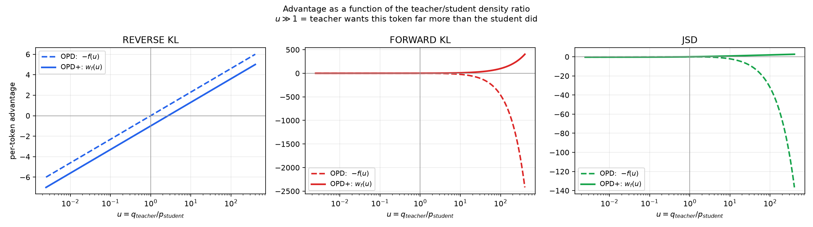
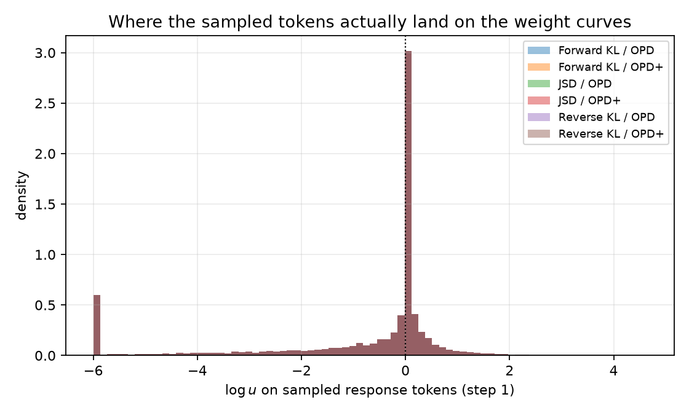
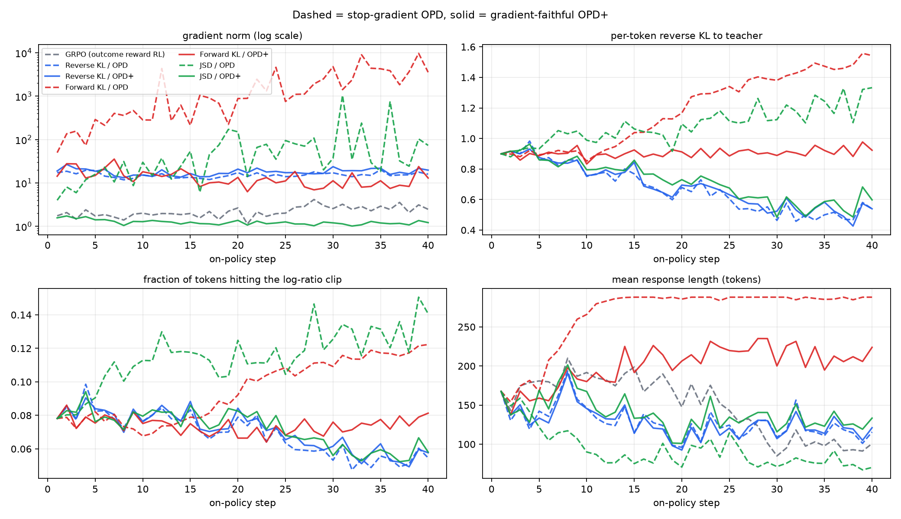
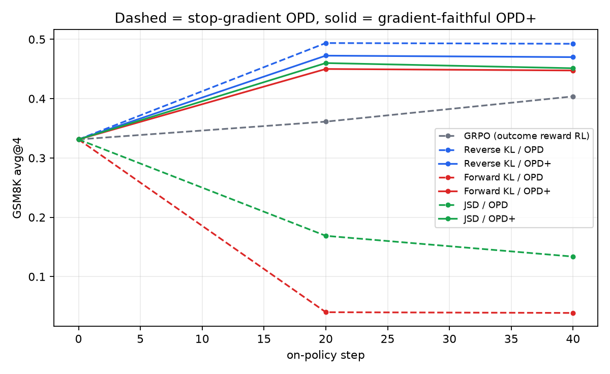
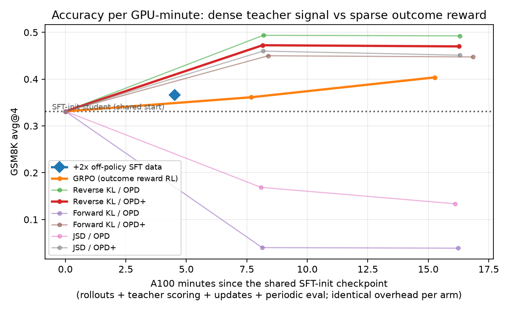

# 单卡 A100 上的 On-Policy Distillation 复现与 advantage 修正验证

## 摘要

在单张 A100 40GB 上从零实现 on-policy distillation（不依赖 TRL / verl / tinker），
以 Qwen3-4B-Instruct-2507 为教师、Qwen3-0.6B-Base 为学生，在 GSM8K 上对比
stop-gradient advantage $-f(u)$ 与 OPD+（[arXiv:2606.01039](https://arxiv.org/abs/2606.01039)）
的梯度保真 advantage $w_f(u) = -f(u) + u f'(u)$，覆盖 forward KL / reverse KL / JSD，
另设 off-policy SFT 与 GRPO 两条对照。九个臂共享同一 SFT-init checkpoint 与同一份 rollout
预算（每臂 2560 条），总耗时 2 小时 15 分。

1. **崩溃与救活完整复现。** forward KL 与 JSD 在 stop-gradient 下从基线 0.331 跌至 0.039
   与 0.134；换成 $w_f(u)$ 后分别达到 0.450 与 0.460。
2. **梯度尺度给出了机理层面的直接证据。** 修正使 forward KL 的平均梯度范数从 1941.7 降到 13.8
   （140×）、JSD 从 92.7 降到 1.25（74×），而 reverse KL 几乎不变（15.4 → 18.0）——
   与「修正项对 reverse KL 是常数、对其余散度不是」的理论预言精确吻合。
3. **被优化的目标本身在反向移动。** 健康臂的 per-token teacher KL 从 0.90 单调降到约 0.50，
   两条崩溃臂反而升到 1.35 与 1.55。它们不是学得慢，是在远离教师。
4. **同等 rollout 预算下稠密信号显著优于稀疏奖励。** reverse KL / OPD 用 1280 条 rollout
   达到 0.494，高于 GRPO 用 2560 条 rollout 的 0.404，而教师前向只占单步开销的 11%。

## 1. 背景与问题

on-policy distillation 让学生自己 rollout、教师逐 token 打分，同时避开 SFT 的 exposure bias
与 outcome-reward RL 的稀疏信用分配。它已进入工业后训练主线：Qwen3 报告 OPD 以约 1/10 的
GPU 小时超过直接 RL；DeepSeek-V4 用纯多教师 OPD 完全替换了 V3 的混合 RL 阶段，
以全词表 reverse KL 把十余个领域专家合并进 1.6T 模型。

业界普遍认为「只有 reverse KL 能用」。OPD+ 指出这可能是实现约定造成的假象：reward $-f(u)$
中的 $u$ 依赖学生参数 $\theta$，而现行实现为数值稳定统一对其做 stop-gradient，数学上有偏。
本项目在小规模上回答：这个偏差是否真能让 forward KL 与 JSD 训崩，修正后能否救回。

## 2. 方法

### 2.1 目标与梯度

沿学生轨迹的 f-散度目标为

$$J^f(\theta) = \mathbb{E}_{y \sim p_\theta(\cdot \mid x)} \left[ \sum_{n=1}^{L_y} f(u_{\theta,n}) \right],
\qquad u_{\theta,n} = \frac{q(y_n \mid y_{<n}, x)}{p_\theta(y_n \mid y_{<n}, x)}$$

对 $\theta$ 求导有两项：轨迹分布的 score function 项，以及 reward 自身对 $\theta$ 的依赖项。
现行实现只保留前者。补上后者等价于把逐 token advantage 从 $-f(u)$ 换成
$w_f(u) = -f(u) + u f'(u)$。

| 散度 | $f(u)$ | OPD: $-f(u)$ | OPD+: $w_f(u)$ |
| --- | --- | --- | --- |
| Forward KL | $u\ln u$ | $-u\ln u$ | $u$ |
| Reverse KL | $-\ln u$ | $\ln u$ | $\ln u - 1$ |
| JSD | $\frac12[u\ln u-(1+u)\ln\frac{1+u}{2}]$ | $-\frac12[u\ln u-(1+u)\ln\frac{1+u}{2}]$ | $\frac12\ln\frac{1+u}{2}$ |

reverse KL 的修正项恰为常数 $-1$，在 score identity
$\mathbb{E}_{p_\theta}[\nabla_\theta \log p_\theta] = 0$ 下作为 baseline 消失——
这解释了它为何是唯一在 stop-gradient 约定下仍然正确的散度。
公式实现由 `tests/test_divergences.py` 用 autograd 反推 $f'(u)$ 逐点校验（8 条断言全通过）。

### 2.2 损失

取 $\gamma = 0$，每 token 只优化自身即时 reward。损失采用 importance sampling 形式，
与 Tinker 的 `importance_sampling` loss 一致，**不做任何 advantage 归一化**——
batch 内 z-score 会把 $-f(u)$ 与 $w_f(u)$ 的差异直接抹平，该约束由单测锁定。

## 3. 实验设置

| 项 | 取值 |
| --- | --- |
| 教师 / 学生 | Qwen3-4B-Instruct-2507 / Qwen3-0.6B-Base |
| 学生初始化 | 2000 条 GSM8K 人工 CoT，1 epoch，lr 1e-5 |
| on-policy 步数 | 40，每步 16 prompt × 4 sample = 64 序列，共 2560 rollout |
| 采样 | temperature 1.0，无 top-k / top-p（任何截断都会破坏 on-policy 假设） |
| prompt | 师生共享同一套 ChatML 渲染与 `<\|im_end\|>` 终止符 |
| 优化器 | AdamW，lr 1e-5，3 步 warmup，grad clip 1.0 |
| log-ratio clip | ±6 |
| 评测 | GSM8K test 200 题，avg@4 (temp 0.7) + greedy，在 step 0 / 20 / 40 各一次 |
| 硬件 | Colab A100 40GB，峰值显存 29.7 GB（OPD）/ 21.6 GB（GRPO） |
| 单步耗时 | OPD 18.1 s，GRPO 16.1 s |

## 4. 结果

### 4.1 主表

按 avg@4 选取最优 checkpoint：

| 臂 | avg@4 | Δ | greedy | pass@4 | A100 min |
| --- | --- | --- | --- | --- | --- |
| SFT-init（共同起点） | 0.3312 | — | 0.490 | 0.660 | 3.4 |
| +2× off-policy SFT 数据 | 0.3663 | +0.035 | 0.550 | 0.690 | 4.5 |
| GRPO（结果奖励 RL） | 0.4037 | +0.073 | 0.540 | 0.700 | 17.5 |
| Reverse KL / OPD | **0.4938** | **+0.163** | **0.585** | 0.790 | 18.6 |
| Reverse KL / OPD+ | 0.4725 | +0.141 | 0.555 | 0.735 | 18.6 |
| Forward KL / OPD | 0.3312 | 0.000 | 0.490 | 0.660 | 18.6 |
| Forward KL / OPD+ | 0.4500 | +0.119 | 0.470 | 0.785 | 19.2 |
| JSD / OPD | 0.3312 | 0.000 | 0.490 | 0.660 | 18.4 |
| JSD / OPD+ | 0.4600 | +0.129 | 0.405 | **0.795** | 18.6 |

forward KL / OPD 与 JSD / OPD 的最优点均落在 step 0，即全程未超过起点，故显示值等于基线——
与 OPD+ 论文表 2 把跌破基线的格子截断到基线的处理一致。它们的实际终点见 4.3。

**avg@4 在 200 题上的标准误约 ±0.03，差距小于约 0.06 的一律不作结论。**

### 4.2 崩溃机理

forward KL 的失效在权重函数上一目了然：$-u\ln u$ 在 $u \to 0$ 时趋于 0，
即教师想要、学生几乎不出的 token 反而拿不到梯度；而在 $u > 1$ 区间它是负的，
等于惩罚学生靠近教师。修正为 $u$ 后 advantage 变为单调正的无界推力，方向才对。

采样 token 的 $\log u$ 分布确认这些区间并非理论边角：均值约 −0.90，约 8% 的 token 撞上 ±6 裁剪。

### 4.3 训练诊断：机理的直接证据

这四个面板比准确率表更能说明问题。全程 40 步的均值：

| 臂 | grad_norm | adv_absmax | teacher_kl | clip_frac | resp_len 首→末 | train_reward 首→末 |
| --- | --- | --- | --- | --- | --- | --- |
| Reverse KL / OPD | 15.4 | 6.00 | 0.671 | 0.069 | 141 → 115 | 0.309 → 0.672 |
| Reverse KL / OPD+ | 18.0 | 7.00 | 0.685 | 0.071 | 143 → 120 | 0.294 → 0.709 |
| Forward KL / OPD | **1941.7** | 2026.6 | 1.187 | 0.095 | 169 → **287** | 0.244 → 0.075 |
| Forward KL / OPD+ | 13.8 | 171.7 | 0.905 | 0.074 | 157 → 212 | 0.234 → 0.381 |
| JSD / OPD | 92.7 | 65.0 | 1.090 | 0.115 | 148 → **75** | 0.266 → 0.284 |
| JSD / OPD+ | **1.25** | 2.01 | 0.717 | 0.072 | 149 → 129 | 0.294 → 0.637 |
| GRPO | 2.24 | 1.50 | — | — | 169 → 97 | 0.272 → 0.519 |

**梯度尺度。** 修正把 forward KL 的平均梯度范数压低 140 倍、JSD 压低 74 倍，
而 reverse KL 基本不变。这正是理论的可证伪预言：修正项对 reverse KL 是常数、不改变梯度，
对其余散度不是。准确率只能说「修好了」，这组数字说明「为什么修好了」。

`adv_absmax` 还提供了一个可直接读出的验证：Reverse KL / OPD 恒为 6.000（等于 clip 边界），
Reverse KL / OPD+ 恒为 7.000（clip + 1）。论文中抽象的常数 $-1$ 在日志里是可见的。

**目标本身在反向移动。** 健康臂的 per-token teacher KL 从 0.90 单调降至约 0.50，
说明学生确实在向教师收敛；两条崩溃臂反而升到 1.35（JSD）与 1.55（forward KL）。
它们不是学得慢，是在被推离教师——这是梯度方向错误的直接证据，比任何下游指标都更贴近病因。

**两种退化形态截然不同。** forward KL 的响应长度从 169 涨到 287，而 `max_new_tokens` 是 288，
即学生退化为几乎永不终止、一路撞长度上限；JSD 相反，从 148 塌缩到 75 的过短输出。
同一个 stop-gradient 缺陷，在两种散度上表现为相反的退化模式。

**`clip_frac` 是可用的先行指标。** 健康臂 0.069–0.074 且随训练下降，
崩溃臂升至 0.095 与 0.115。它比准确率更早给出预警，训练中可直接用于早停。

### 4.4 训练曲线

各臂在 step 0 / 20 / 40 的 avg@4：

| 臂 | step 0 | step 20 | step 40 |
| --- | --- | --- | --- |
| Reverse KL / OPD | 0.3312 | 0.4938 | 0.4925 |
| Reverse KL / OPD+ | 0.3312 | 0.4725 | 0.4700 |
| Forward KL / OPD | 0.3312 | 0.0400 | 0.0387 |
| Forward KL / OPD+ | 0.3312 | 0.4500 | 0.4475 |
| JSD / OPD | 0.3312 | 0.1688 | 0.1338 |
| JSD / OPD+ | 0.3312 | 0.4600 | 0.4512 |
| GRPO | 0.3312 | 0.3613 | 0.4037 |

崩溃是**主动的**而非停滞：forward KL 在 20 步内损失了 88% 的相对准确率且不再恢复。
所有 OPD 臂在 step 20 已达平台，而 GRPO 到 step 40 仍在上升、未见拐点。

### 4.5 成本-效果

GRPO 与 OPD 的每步开销几乎相同（16.1 s 对 18.1 s），**教师前向仅占单步开销的 11%**，
却把每条 rollout 的监督从 1 bit 扩展到上百个 token 的稠密梯度。代价相近而信号量级不同，
这正是 OPD 算力优势的来源——省的不是采样成本，是达到同等效果所需的步数。

具体地，reverse KL / OPD 在 step 20（1280 条 rollout）达到 0.4938，
而 GRPO 跑满 step 40（2560 条 rollout）仅到 0.4037：**一半预算高出 0.09，且 GRPO 曲线未见拐点。**

「多喂 off-policy 数据」这条路收效甚微：额外 4000 条样本只带来 +0.035，落在噪声内。

## 5. 讨论

### 5.1 mode-seeking 与 mass-covering

以 step 40 终点比较 greedy 相对基线（0.490）的变化：reverse KL / OPD +0.120，
JSD / OPD+ +0.040，Forward KL / OPD+ **−0.040**。forward KL 是唯一 avg@4 上涨（+0.116）
而 greedy 反跌的臂，符合 mass-covering 铺开概率质量、钝化 argmax 路径的预期；
reverse KL 的 mode-seeking 则同时抬高了两者。

选型含义：面向单次贪心输出的线上服务应选 reverse KL；
面向 best-of-n 的场景可考虑 JSD+，它拿到了全场最高的 pass@4（0.795）。

**方法学提醒：** 主表的 greedy 列不是「最佳 greedy」，而是「avg@4 最优 checkpoint 上的 greedy」。
JSD / OPD+ 在 step 20 的 greedy 是 0.405，在 step 40 是 0.530；混读两者会得出相反结论。

### 5.2 一处未复现，及为何这是正确结果

OPD+ 论文报告 reverse KL+ 略优于 reverse KL；本实验为 0.4725 对 0.4938，方向相反。
但 0.021 的差距不足一个标准误，**统计上不可区分**。理论上也应如此：该散度的修正项是常数
baseline，期望梯度完全不变，论文自身也把收益归于方差控制。
方差层面的二阶效应，200 题、单 seed、40 步无法分辨，此处不作结论。

值得注意的是 reverse KL+ 的训练侧奖励反而更高（末 5 步 0.709 对 0.672），
与评测结论相反，进一步说明这个差距是噪声。

### 5.3 一处预期落空

设计初期师生使用了不同的 prompt 渲染（教师走 chat template、学生走纯文本 completion），
导致学生以 `<|endoftext|>` 结束而教师在 ChatML 上下文中把终止概率几乎全给 `<|im_end|>`，
在 reverse KL 下形成每条 rollout 终止 token 上方向恒定的负 advantage。
改为师生共享 ChatML prompt（与 Tinker 参考实现对齐）后偏置消除，
但 `clip_frac` 与 `teacher_kl` 几乎未变（8.7% → 约 7%，0.90 → 0.90 起步）。

结论：格式差异确实是一处方向性偏置，但并非这两个指标的主要来源，
真正来源是 4B→0.6B 的 capacity gap 本身。这与文献自洽——OPD+ 论文用的是 8B→8B
（同尺寸、分布差距最小），FiRe-OPD 则把 strong-to-weak 单列为更困难的场景，
并指出教师 log-probability 低意味着「教师在给一种它不熟悉的推理风格打分」，此时监督不可靠。

## 6. 局限

- 规模比 OPD+ 论文小两个量级（4B→0.6B 对 8B→8B），任务为 GSM8K 而非竞赛数学。
- 单 seed、40 步、200 题评测，标准误约 ±0.03，只有 Δ > 0.06 的结论可信。
- 因此本项目支撑的是 **advantage 函数形状导致的定性失效与恢复机理**，
  这类现象由函数形状决定、与规模关系不大；定量排序（如 JSD+ 是否优于 reverse KL）不构成结论。
- Busbridge et al. (2025) 的 capacity gap 结论提示，教师过强时 forward KL 的 mode-covering
  压力会被放大、reverse KL 的 mode-seeking 可部分缓解。本实验的师生差距远大于论文设定，
  forward KL 即便修正后（0.450）仍略低于 reverse KL（0.494），与该预期一致。
- 各臂训练后的权重未保存，无法给出崩溃模型的定性输出样例。

## 7. 后续方向

- **轨迹级过滤。** FiRe-OPD 丢弃归一化 teacher log-probability 最低的 20% rollout，
  其消融显示这是该方法收益中最大的一块；本实验 7% 左右的 `clip_frac` 说明确有可过滤的空间。
- **早停信号。** `clip_frac` 与 teacher KL 的上升先于准确率崩塌，可作为在线监控与自动早停的依据。
- **logit top-k 蒸馏** 与当前单 token likelihood 的信息量／成本权衡（DeepSeek-V4 用的是全词表）。
- **多轮 agent 轨迹蒸馏**，综述将其列为开放问题。
